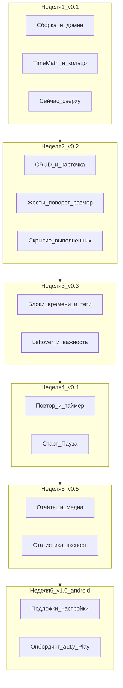
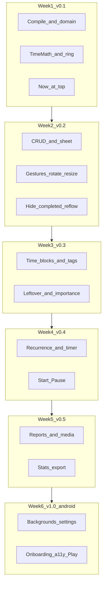

# TimeDial Planner — 6-week roadmap

Bilingual kickoff document. Product canon: [TZ.md](TZ.md) (clock-face day planner, flexible time, tags, timer, reports). Delivery: **Android-first** inside the existing Compose app. Kotlin Multiplatform, iOS, Maven Central, and calendar sync are **v2**, not this six-week track.

- [Русский](#русский)
- [English](#english)

---

## Русский

### Схема дорожной карты



Ритм: **6 дней фич + 1 день полировка / тесты / тег версии**. Промпты: [DAILY_PROMPTS.md](DAILY_PROMPTS.md). Спека: [TZ.md](TZ.md).

### Анализ ТЗ

Исходная цель: план дня **не списком**, а **циферблатом**. Дополнение (неделя 3+): гибкое время, теги, повтор, таймер, отчёты.

| Требование ТЗ | Как закрываем за 6 недель |
|---------------|---------------------------|
| Цветные сектора задач + текст на циферблате | Неделя 1: Canvas-кольцо, `TimeMath` |
| Тап → полное описание | Неделя 2: hit-test + BottomSheet; неделя 4: облако + z-order |
| Выполненные серым | Неделя 1–2: статус `DONE` → `completedColor` |
| Скрыть выполненные и дать место живым | Неделя 2: compact reflow; неделя 3: leftover после исключения DONE |
| Жесты: вращать часы, увеличивать задачу | Неделя 2; прошедшие блоки недели 4+ не resize |
| DIAL / PIZZA / PETALS / LIST | Уже в `:app` (`DialRenderer`); слой отрисовки, не цель недели 3 |
| Задачи без времени + важность 5:3:2 | Неделя 3: leftover вместо Отдыха |
| Несколько отрезков одной задачи | Неделя 3: `TimeBlock[]`, один `TaskId` |
| Теги | Неделя 3 |
| Перенос, дубликат, daily/weekdays | Неделя 4 |
| Старт/Пауза в центре, append-only | Неделя 4 |
| Отчёты с текстом и медиа | Неделя 5, файлы в app storage |
| Подложки и настройки вида | Неделя 6 |
| «Сейчас» сверху | Неделя 1: сцена, не мутация времён |

ТЗ.docx дополнительно требует KMP-библиотеку `:timedial-kit`, iOS 15+, Google/Apple Calendar, публикацию в Maven Central и два магазина за 5 недель. Для текущего репозитория это **не старт**, а отдельный горизонт.

### Состояние репозитория на старт

Проект [ClockPlannerProject](../) — шаблон Jetpack Compose (`minSdk 29`, `compileSdk 36`, namespace `com.example.clockplannerproject`).

- Навигация-заглушка: Home / Favorites / Profile в [MainActivity.kt](../app/src/main/java/com/example/clockplannerproject/MainActivity.kt).
- Модели в [ClockSegmentData.kt](../app/src/main/java/com/example/clockplannerproject/data/ClockSegmentData.kt) не собираются (опечатка `Dioganal`, пустой `ClockData()`, несогласованный `ClockSegment`).
- Canvas-черновики [DrawClock.kt](../app/src/main/java/com/example/clockplannerproject/ui/clock/DrawClock.kt) и [DrawClockSegment.kt](../app/src/main/java/com/example/clockplannerproject/ui/clock/DrawClockSegment.kt) без импортов Compose, с неверным `when` и обращением к несуществующим полям.

Старт = **починить сборку и домен**, а не создавать 12 Gradle-модулей.

### Улучшения относительно ТЗ (принятые)

1. **Android-first.** Модели и рендер живут в пакетах `kit.*` внутри `:app`. Вынос в отдельный Android-модуль — опционально после недели 6. KMP/iOS — после v1.0-android.
2. **Границы пакетами, не Gradle.** День 1 не дробит `:feature:*` / `:sync:*`. Контракты: `TaskRepository`, `TimeProvider`, `DialRenderer`.
3. **Календарь, Maven Central, App Store** — v2 (в самом ТЗ календарь уже в roadmap v2).
4. **Перераспределение секторов** при скрытии выполненных — явная фича.
5. **Hit-test и перекрытия** задач — специфицируем в промптах (в ТЗ почти нет).
6. Навигация: **День / Задачи / Настройки**. Оболочку `NavigationSuiteScaffold` оставляем.
7. Локализация ru/en и TalkBack — **неделя 6**, не «после магазинов».
8. DI: **Koin** (как в ТЗ). Не подключать Hilt параллельно.
9. Дата/время в домене: **kotlinx-datetime**, не `java.time` в kit-пакетах.
10. **Нет класса Room `Migration`.** Смена схемы: `version++` + `fallbackToDestructiveMigration()`; обновление = переустановка / wipe.
11. Доли leftover и углы — только `kit.core.layout` / `TimeMath`, не в UI.

### Отложено в v2

- Kotlin Multiplatform, iOS, Compose Multiplatform.
- Google Calendar / Apple Calendar.
- Публикация `:timedial-kit` в Maven Central / JitPack.
- Виджеты Glance / Wear OS, облако, AI-раскладка дня, совместное планирование.

### Целевой каркас пакетов (внутри `:app`)

```
com.example.clockplannerproject
  kit.core          Task, TimeBlock, Importance, ViewMode, TimeMath, layout leftover, TaskRepository
  kit.render        DialRenderer, TimeDialRenderer, PizzaRenderer, PetalsRenderer, hit-test
  kit.compose       TimeDial, DialView, TaskBottomSheet, ListDayView
  data              Room entities (destructive version bump), reports media URIs, DataStore
  di                Koin modules
  ui.day            экран дня + MVI + таймер в центре
  ui.task           список / редактор / теги / повтор
  ui.settings       внешний вид (неделя 6)
  ui.stats          отчёты и статистика (неделя 5)
  ui.theme          Material 3
```

Правило зависимостей: `kit.render` не знает Room и экраны; `ui.*` не считает углы вручную — только через `TimeMath`.

### Недели и Definition of Done

| Неделя | Версия | Цель | DoD |
|--------|--------|------|-----|
| 1 | v0.1 | Живой циферблат | Debug-сборка; цветные сектора; текст задачи; «сейчас» сверху; unit-тесты `TimeMath` |
| 2 | v0.2 | Интерактивность | CRUD; sheet; поворот; resize; hide completed reflow; DONE серым |
| 3 | v0.3 | Гибкое время + теги | Несколько `TimeBlock`; untimed заполняют leftover; веса 5:3:2; теги; timed+untimed на DIAL/PIZZA; wipe DB |
| 4 | v0.4 | Экземпляры и таймер | Перенос дня, дубликат, daily/weekdays; тап поднимает сектор + облако; Start/Pause; append-only |
| 5 | v0.5 | Отчёты | Текст + медиа на задачу; список отчётов; статистика/экспорт вторично |
| 6 | v1.0-android | Оболочка | Подложки, DataStore настроек, онбординг, ru/en, TalkBack, Play-чеклист |

### Риски

| Риск | Митигация |
|------|-----------|
| Слишком много Gradle-модулей в день 1 | Пакеты + интерфейсы |
| Жесты конфликтуют с поворотом «сейчас сверху» | Пользовательский offset + автоповорот как отдельные поля |
| Перекрытия задач на 24h-кольце | Правила z-order и hit-test по наименьшему sweep |
| Timed + untimed на одной половине | Leftover pool; доли только в `kit.core.layout` |
| Важность vs часы стены | Веса 5:3:2 только для leftover, не для civil блоков |
| Смена схемы Room | Нет Migration: destructive bump, переустановка |
| Canvas тормозит | `drawWithCache`, никаких аллокаций Path/Paint в `draw()` |
| Расползание кастомизации | Один `TimeDialConfig`, копирование через `copy()` |

### Как пользоваться стартовым пакетом

1. Прочитать этот файл и [AGENTS.md](../AGENTS.md).
2. На каждый день копировать промпт из [DAILY_PROMPTS.md](DAILY_PROMPTS.md) в Cursor Agent.
3. Не смешивать цели двух дней в одном чате, если агент начинает расползаться.
4. День 7 / 14 / 21 / 28 / 35 / 42 — только полировка, тесты, тег версии (`v0.1` … `v1.0-android`).

---

## English

### Roadmap diagram



Cadence: **6 feature days + 1 polish / tests / version tag**. Daily prompts: [DAILY_PROMPTS.md](DAILY_PROMPTS.md). Spec: [TZ.md](TZ.md).

### TZ analysis

Original intent: the day plan is a **clock face**, not a list. Week 3+ add flexible time, tags, recurrence, timer, reports.

| TZ requirement | Six-week coverage |
|----------------|-------------------|
| Colored task sectors + labels | Week 1: Canvas ring, `TimeMath` |
| Tap opens full description | Week 2: sheet; week 4: callout + z-order |
| Completed tasks gray | Weeks 1–2: `DONE` → `completedColor` |
| Hide completed, give space to remaining work | Week 2 compact reflow; week 3 leftover after dropping DONE |
| Gestures: rotate, resize | Week 2; past blocks not resizable from week 4 |
| DIAL / PIZZA / PETALS / LIST | Already in `:app`; render layer, not week-3 goal |
| Untimed tasks + importance 5:3:2 | Week 3 leftover instead of Rest |
| Several intervals per task | Week 3: `TimeBlock[]`, one `TaskId` |
| Tags | Week 3 |
| Move, duplicate, daily/weekdays | Week 4 |
| Center Start/Pause, append-only | Week 4 |
| Reports with text and media | Week 5, app storage |
| Backgrounds and appearance settings | Week 6 |
| Now at the top | Week 1: scene rotation, do not mutate times |

The Word TZ also asks for a KMP `:timedial-kit`, iOS 15+, Google/Apple Calendar, Maven Central, and two store listings in five weeks. That is **not** the start for this repo.

### Repository state at kickoff

[ClockPlannerProject](../) is a Jetpack Compose template (`minSdk 29`, `compileSdk 36`, namespace `com.example.clockplannerproject`).

- Placeholder destinations Home / Favorites / Profile in [MainActivity.kt](../app/src/main/java/com/example/clockplannerproject/MainActivity.kt).
- Models in [ClockSegmentData.kt](../app/src/main/java/com/example/clockplannerproject/data/ClockSegmentData.kt) do not compile (`Dioganal`, empty `ClockData()`, inconsistent `ClockSegment`).
- Canvas drafts [DrawClock.kt](../app/src/main/java/com/example/clockplannerproject/ui/clock/DrawClock.kt) and [DrawClockSegment.kt](../app/src/main/java/com/example/clockplannerproject/ui/clock/DrawClockSegment.kt) miss Compose imports, misuse `when`, and read missing fields.

Kickoff means **make the project compile and own a real domain**, not spawn twelve Gradle modules.

### Improvements vs TZ (accepted)

1. **Android-first.** `kit.*` packages live in `:app`. Optional Android library module after week 6. KMP/iOS after v1.0-android.
2. **Package boundaries, not Gradle.** Day 1 does not create `:feature:*` / `:sync:*`. Contracts: `TaskRepository`, `TimeProvider`, `DialRenderer`.
3. **Calendar, Maven Central, App Store** — v2.
4. **Sector reflow** when hiding completed tasks is an explicit feature.
5. **Hit-testing and overlaps** are spelled out in daily prompts.
6. Navigation: **Day / Tasks / Settings**. Keep `NavigationSuiteScaffold`.
7. ru/en localization and TalkBack — **week 6**.
8. DI: **Koin** only (no Hilt in parallel).
9. Domain time: **kotlinx-datetime**, not `java.time` in kit packages.
10. **No Room `Migration` class.** Schema change: `version++` + `fallbackToDestructiveMigration()`; update = reinstall / wipe.
11. Leftover shares and angles only via `kit.core.layout` / `TimeMath`, never in UI.

### Deferred to v2

- Kotlin Multiplatform, iOS, Compose Multiplatform.
- Google Calendar / Apple Calendar.
- Publishing `:timedial-kit` to Maven Central / JitPack.
- Glance / Wear OS widgets, cloud sync, AI scheduling, shared planning.

### Target package layout (inside `:app`)

Same tree as in the Russian section. `kit.render` must not know Room or screens. `ui.*` must not compute angles except via `TimeMath`.

### Weeks and Definition of Done

| Week | Version | Goal | DoD |
|------|---------|------|-----|
| 1 | v0.1 | Live dial | Debug build; colored sectors; labels; “now” at top; `TimeMath` unit tests |
| 2 | v0.2 | Interactivity | CRUD; sheet; rotate; resize; hide-completed reflow; gray DONE |
| 3 | v0.3 | Flexible time + tags | Multiple `TimeBlock`s; untimed fill leftover; weights 5:3:2; tags; timed+untimed on DIAL/PIZZA; wipe DB |
| 4 | v0.4 | Instances and timer | Move day, duplicate, daily/weekdays; tap raises sector + cloud; Start/Pause; append-only |
| 5 | v0.5 | Reports | Text + media on a task; report list; stats/export secondary |
| 6 | v1.0-android | Shell | Backgrounds, DataStore settings, onboarding, ru/en, TalkBack, Play checklist |

### Risks

| Risk | Mitigation |
|------|------------|
| Too many Gradle modules on day 1 | Packages + interfaces |
| Gestures fight auto-rotation | User offset and auto-rotate as separate fields |
| Overlapping tasks on a 24h ring | Z-order + hit-test smallest sweep |
| Timed + untimed on one face | Leftover pool; shares only in `kit.core.layout` |
| Importance vs wall-clock | Weights 5:3:2 apply to leftover only, not civil blocks |
| Room schema change | No Migration: destructive bump, reinstall |
| Canvas jank | `drawWithCache`; no Path/Paint allocs in `draw()` |
| Customization sprawl | One `TimeDialConfig`, mutate via `copy()` |

### How to use this kickoff pack

1. Read this file and [AGENTS.md](../AGENTS.md).
2. Each day, paste the prompt from [DAILY_PROMPTS.md](DAILY_PROMPTS.md) into Cursor Agent.
3. Do not mix two days in one chat if the agent starts expanding scope.
4. Days 7 / 14 / 21 / 28 / 35 / 42 are polish, tests, and a version tag (`v0.1` … `v1.0-android`).
